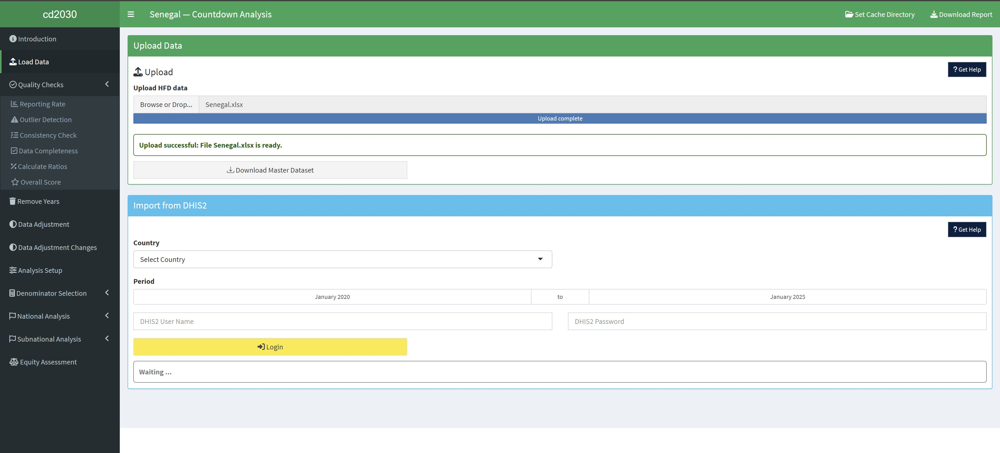

<!-- README.md is generated from README.Rmd. Please edit that file -->

# cd2030

<!-- badges: start -->
<!-- badges: end -->

## Introduction

This is a web app for analysing vaccine data for the Countdown 2030.
It’s also an R package so you can use some features in the code
directly.

## Features

- Analyze vaccine data for Countdown 2030.
- Use as an R package for programmatic access.
- Interactive visualizations for quick insights.

## Installation

You can install a stable version of cd2030 from
[GitHub](https://github.com/) with:

``` r
install.packages("devtools")
devtools::install_github("aphrcwaro/cd2030@v1.0.0")
```

## Development version

To get a bug fix or to use a feature from the development version, you
can install the development version of cd2030.

``` r
install.packages("devtools")
devtools::install_github("aphrcwaro/cd2030")
```

## Running the App

Start the web dashboard:

``` r
cd2030::dashboard()
```

## Example Usage

Analyze vaccine data programmatically:

``` r
library(cd2030)

data <- cd2030::load_excel_data('/path/to/hfd/data.xlsx')
calculate_average_reporting_rate(data)
```

## Dashboard Preview

Here is a preview of the dashboard:

<figure>

<figcaption aria-hidden="true">Dashboard Screenshot</figcaption>
</figure>

## Getting help

If you encounter a clear bug, please file an issue with a minimal
reproducible example on
.

## Contributing

Contributions to improve the **cd2030** package are welcome! Please fork
the repository, make your changes, and submit a pull request.
